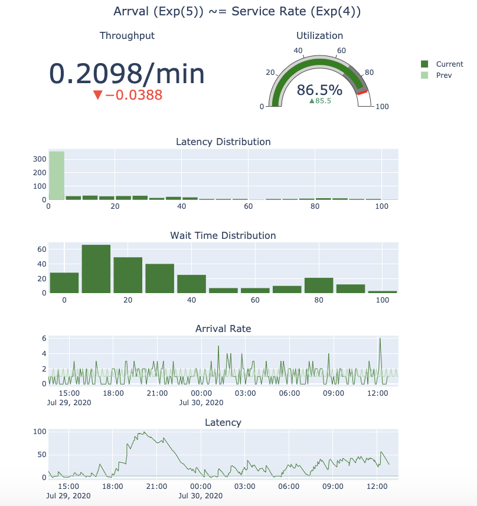

# All Your Queues Belong To Us: Optimizing the human in the loop
This GitHub repo contains all code and slides used to present [All your Queues Belong to Us: Optimizing the Humans in the Loop](https://www.dashcon.io/talks/all-your-queues-belong-to-us-optimizing-the-humans-in-the-loop/) at [DashCon](https://www.dashcon.io/) 2020.

In our talk we explore how to use mathematics and simulation to optimize the workflow in a security operations center (SOC). Using historical data Expel collected over the past year and our many years of experience from building and running the SOC at Expel, we are going to demostrate the impact of various optimizations we've made to our SOC over the years. The optimizations include introducing alert severities, tiering analysts, and reducing investigation and incident response time. For each case we'll use [CIW](https://ciw.readthedocs.io/en/latest/) to simulate the impact on the SOC and its performance. Throughout the presentation we use the following notebook to visualize the impact of various optimizations: 



## Disclaimers
We've made a few bug fixes since we recorded the presentation, that combined with the fact that CIW is doing Monte Carlo simulations means you when you run the notebook you will have different values than what you see presented. However those values should not deviate much from the presentation.

# Files
* `All_Your_Queues_DashCon_2020.ipynb` -- Notebook with code and presentation.
* `All_Your_Queues_DashCon_2020.slides.html` -- The slides generated from notebook
* `arr_times.pickle` _(yes, this is poorly named and shouldn't be a pickle file)_ -- Pickled dictionary containing list of counts observed for the past year, for a given day, hour and severity. Indexable by day -> hour -> severity (HIGH, MEDIUM, LOW) 
* `arr_times_csv.zip` -- A CSV of alert arrival times


# Usage

## Notebook 
There are three options when it comes to running the notebook.

1. You can just run jupyter locally and view the notebook.
2. You can build a docker image locally. To do this, run the following commands:
```sh
$ docker build --tag dashcon-queues:latest .
$ docker run -it  -p 8888:8888 --name dashcon-queues dashcon-queues:latest notebook
```
3. To download and use the published docker image run the following command:
```sh
$ docker run -it -p 8888:8888 expelio/dashcon-all-your-queues:latest notebook 
```

In all cases the URL for your notebook and security token will print to stdout. Navigate to the URL with your favorite web browser and open up the file *All\_Your\_Queues\_DashCon\_2020.ipynb*. 


## Presentation 
There are two options for viewing the slides. We recommend viewing them locally in your browser the docker command has been finicky.

Option 1: View the presentation by running the docker image:
```sh
$ docker run -it -p 8910:8910 expelio/dashcon-all-your-queues:latest present
```
Navigate your web browser to `http://127.0.0.1:8910/All_Your_Queues_DashCon_2020.slides.html#`

Option 2: View the presentation that is checked into GitHub repo, simply open `All_Your_Queues_DashCon_2020.slides.html`
